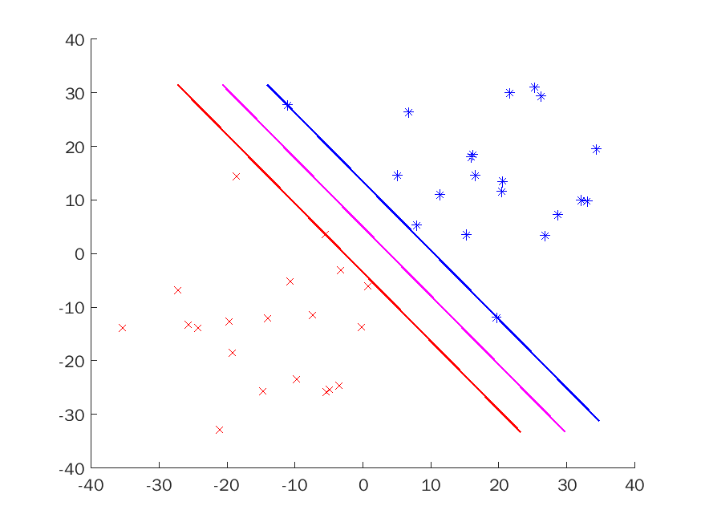

# Hard Margin Support Vector Machine

# points and images
v{1} = [1, 2, 3, 1, 1, 3, -1, -3;-1, 0, -2, -0.5, -4, -3, -3,-3];
u{1} = [-1, -1, 0, 1, -3, -4, 0.5, 3, 0.5;0, 1, 2, 3, 0, -2, 2, 2.5, 2.5];

---
set rng(14175332)
----

u{2} = 10.1 * randn(2,20)+15;
v{2} = -10.1 * randn(2,20)-15;

u{3} = 10.1 * randn(2,20)+10;
v{3} = -10.1 * randn(2,20)-10;

u{4} = 10.1 * randn(2,50)+18;
v{4} = -10.1 * randn(2,50)-18;
